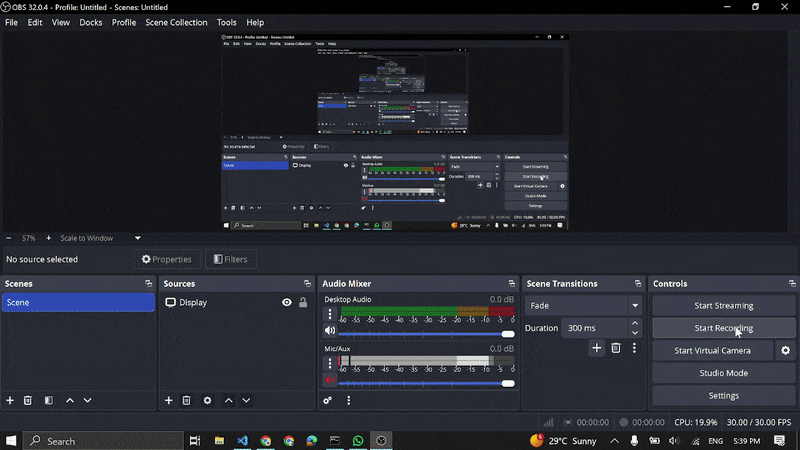

# Ben 10 Omnitrix Selector

An interactive 2D alien selection interface inspired by the Ben 10 cartoon series. Transform into different aliens with immersive audio and visual effects!

## Demo



## Features

✨ **Alien Rotation Ring** - Navigate through 10 different aliens in a circular interface
- Heatblast
- Wildmutt
- Diamondhead
- XLR8
- Grey Matter
- Four Arms
- Stinkfly
- Ripjaws
- Upgrade
- Ghostfreak

🎬 **Visual Transformations** - Smooth GIF animations for each alien transformation

🔊 **Dynamic Audio System**
- Arrow key navigation sounds
- Alien selection confirmation sounds
- Alien-specific transformation sounds
- Countdown timer audio

⏱️ **Countdown Timer** - 10-second countdown displayed during transformation

⌨️ **Keyboard Controls** - Easy navigation and selection using arrow keys

## How to Use

1. Open `index.html` in your web browser
2. Use arrow keys to rotate through the alien selection ring
3. Press Enter to select an alien
4. Watch the transformation animation with sound effects
5. The countdown timer tracks the remaining transformation time

## Project Structure

```
ben10/
├── index.html              # Main HTML file
├── script.js               # JavaScript logic for interactions
├── style.css               # Styling and animations
├── gif.txt                 # GIF source references
├── gif/                    # Transformation GIFs for each alien
├── images/                 # Static alien images
├── sounds/                 # UI sound effects
└── aliens_sounds/          # Individual alien transformation sounds
```

## File References

- **GUI Sounds**: `arrow_key.wav`, `enter.wav`, `countdown.wav`
- **Alien Sounds**: Individual WAV files for each alien
- **Alien GIFs**: Transformation animations for each alien
- **Alien Images**: Static PNG images for the selection ring

## Browser Compatibility

This project works best on modern browsers that support:
- HTML5
- CSS3 (animations and transforms)
- Web Audio API
- ES6 JavaScript

## Credits

**Developer**: Aditya Bhardwaj  
**Section**: D2  
**Roll No**: 08  
**Course**: B TECH  
**Branch**: CSE

Inspired by Ben 10 and the iconic Omnitrix device.
